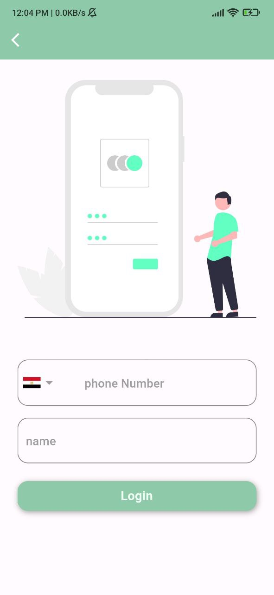

# charity clothes

#### We are designing this Mobile app for donating unwanted old clothes. To use the app, users simply snap a photo of the item they would like to give away and then answer a few short questions. The app will then match the item with the appropriate charity and reach out to the user to schedule a pick-up time.

## Technologies
Flutter 
Firebase 
## key Features
State management: Getx,Mvvm,repository patterns. 
Backend: Firebase. 
Local database: sqlite,shared prefernces.  

## Features
A charity clothes app can offer various features to facilitate the process of donating clothes for charitable purposes. Here are some common features you might find in such an app:

Phone Number Authentication: Users can sign in or create an account using their phone number instead of traditional email-based authentication. This simplifies the registration process and eliminates the need for remembering usernames and passwords.

User Profiles: Users can create profiles to manage their donations, track their contributions, and view their transaction history.

Donation Listings: The app allows users to create listings for clothes they wish to donate. They can provide details such as item description and photos to give potential buyers a clear understanding of what is being offered.

Donation Requests: Charitable organizations or individuals in need can submit requests for specific types of clothing , and users can choose to fulfill those requests by donating the requested items.

Geo-Location : The app can leverage location services to provide users with information about nearby donation centers, drop-off points, or charity events related to clothing donations.

## Setup
install all packages by flutter pub get and add images in assets folder in your pc/laptop.
